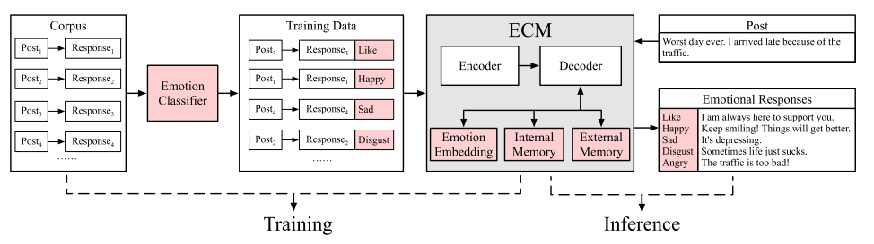

# 论文笔记：《Emotional Chatting Machine: Emotional Conversation Generation with Internal and External Memory》

ECM是第一个在大规模对话生成中考虑情感因素的工作。引入了三个新的机制：（1）通过嵌入情感类别来模拟情绪表达的高级抽象；（2）捕捉内部隐式的情感状态变化；（3）使用外部情感词典进行显式的情感表达

## 介绍

缺少高质量的情感标注数据==》训练了自动分类器

很难以自然连贯的方式考虑情感，平衡语法和情感表达==》seq2seq+情感类别嵌入+内部情感状态

生成的回复表达情感十分模糊含蓄==》加入外部情感记忆

## 模型

- Encoder-Decoder框架 

- Emotion Category Embedding

  每个情感类别用**向量**代替，随机初始化，训练过程中学习，用于decoder更新状态。

- Internal Memory

  情感类别向量是静态的，在解码阶段加入内部记忆捕捉**动态情感变化**。每个类别有一个内部情感状态，随着解码过程不断衰减。

- External Memory

  内部记忆是隐式表达，不能直接观测，解码时加入外部记忆显式地从通用词典和**情感词典**中选择输出词汇。

- Loss Function

  预测值与真实值交叉熵，最后一步的内部情感状态以及外部记忆的决策变量。

## 数据

训练精确度在62.3%的Bi-LSTM情感分类器自动标注中文微博语料STC，标签有六类。

## 结果

- 自动评估
  - 困惑度衡量回复语句的相关性与语法性
  - 精确度计算回复的情感类别与预期的情感类别
- 人工评估

## 未来展望

不指明回复的情感类别，让模型自行选择最合适的情感类别进行回复。